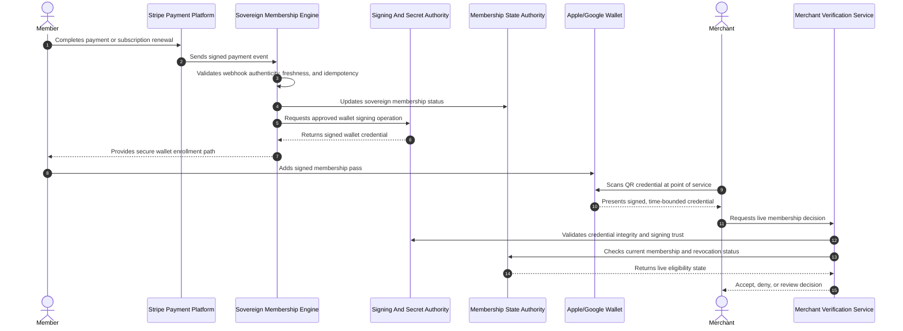

# Project Proposal And Strategic Roadmap: VegSpoons Sovereign Membership Engine

## Executive Summary

VegSpoons has an immediate opportunity to harden its membership infrastructure while creating a stronger mobile verification experience for members and merchants. The current Apache 2.4.58 environment has reported critical exposure, including vulnerabilities rated up to 9.8 CVSS. The proposed response is not a risky full-platform rebuild. It is a controlled extraction of critical payment, pass issuance, and merchant verification logic into a serverless AWS Lambda sidecar.

The VegSpoons Sovereign Membership Engine will preserve the existing directory site while moving high-trust membership operations into a hardened, auditable, and cryptographically controlled workflow. The result is lower infrastructure risk, reduced fraud exposure, and a wallet-native member experience that merchants can verify in real time.

## Strategic Objective

The objective is to separate critical membership trust decisions from the legacy web tier and place them behind a purpose-built security boundary.

This gives VegSpoons:

- Reduced blast radius from Apache or legacy application vulnerabilities.
- Financial-grade webhook validation from Stripe.
- Signed wallet credentials for Apple Wallet and Google Wallet.
- HMAC-signed QR payloads that cannot be modified without detection.
- Real-time merchant verification instead of screenshot-based proof.
- Audit-ready controls aligned to ISO 27001-style governance.

## Current Risk Position

The existing platform has three material risk categories:

| Risk Area | Business Impact | Proposed Control |
| --- | --- | --- |
| Critical Apache exposure | Public web-tier compromise may affect trust-sensitive membership flows | Move critical trust logic to an isolated serverless sidecar |
| Screenshot-based fraud | Inactive or forged membership proof may be accepted by merchants | Require live verification of cryptographically signed QR credentials |
| Secret and signing sprawl | Payment and wallet trust material may become difficult to govern | Centralize secrets, certificates, and signing authority under controlled cloud services |

The architectural priority is to make the legacy site less responsible for trust decisions. The directory site can continue serving content and membership UX, while the Sovereign Membership Engine becomes the authoritative layer for payment-triggered membership state and merchant verification.

## Proposed Architecture

The proposed design is a serverless sidecar architecture. The sidecar is sovereign because it owns its trust boundary, signing process, verification rules, audit trail, and security controls without depending on the legacy application runtime.

Core components:

- **Stripe event intake:** Receives payment and subscription lifecycle signals.
- **Webhook trust boundary:** Verifies event authenticity before business processing.
- **Membership state authority:** Maintains current eligibility and revocation state.
- **Wallet signing authority:** Produces Apple and Google wallet credentials using controlled certificate and key material.
- **QR credential issuer:** Generates HMAC-signed, time-bounded QR payloads for scan verification.
- **Merchant verification service:** Returns live accept, deny, or review decisions at scan time.
- **Audit and evidence layer:** Records key events for dispute handling, fraud review, and security reporting.

The legacy site remains operational and familiar to members. Critical membership issuance and verification move behind a cloud-native boundary designed for least privilege, observability, and rapid containment.

## Infrastructure Hardening Strategy

### Legacy Web-Tier Risk Reduction

The Apache environment should no longer be the primary enforcement point for high-trust membership decisions. Even after patching and configuration hardening, legacy web tiers remain broad attack surfaces because they usually combine public routing, presentation logic, session handling, plugins, and business workflows.

The proposed sidecar reduces this risk by:

- Removing payment-to-membership logic from the exposed web tier.
- Keeping wallet signing outside the legacy host.
- Preventing merchant scan decisions from depending on pages or screenshots.
- Allowing security controls to be applied independently of the existing site.
- Enabling fast rollback or isolation of the new trust layer without disrupting the directory site.

### Serverless Trust Boundary

The serverless sidecar should be treated as a controlled security enclave for membership operations.

Security expectations:

- No long-lived servers to patch for the new critical workflow.
- Minimal public API surface.
- Strict separation between presentation, payment events, wallet signing, and merchant verification.
- Least-privilege access to state stores and signing material.
- Centralized audit logging with sensitive-value redaction.
- Regional operation and data residency controls appropriate for the business.

### Operational Resilience

The sidecar should be stateless at runtime and stateful only through governed cloud data services. This supports controlled scaling, predictable recovery, and clean incident response.

Resilience outcomes:

- Duplicate payment events do not create duplicate memberships.
- Wallet credentials can be revoked or reissued without modifying the legacy site.
- Merchant verification can fail closed when authenticity cannot be proven.
- Audit records can support incident review and customer dispute resolution.

## Financial-Grade Security Model

### Webhook Integrity

Stripe events must be validated before they are trusted. The webhook handshake should enforce authenticity, freshness, and replay resistance.

Required controls:

- Signature validation against the exact received payload.
- Timestamp tolerance to limit replay windows.
- Idempotent event handling to prevent duplicate issuance.
- Segregation between event receipt and entitlement decisions.
- Audit evidence for accepted, rejected, and replayed events.

Business outcome: VegSpoons can rely on Stripe events as a controlled trigger for wallet issuance without giving the legacy web tier authority over payment truth.

### HMAC-Signed QR Credentials

QR codes should not be static membership labels. They should carry signed, time-bounded credentials whose integrity can be checked by the verification service.

Required controls:

- HMAC signatures over the QR payload.
- Short validity windows for scan credentials.
- Strong random nonces to support replay detection.
- No payment card data or unnecessary personal data in QR payloads.
- Live server-side decisioning at scan time.

Business outcome: A screenshot of a pass is not sufficient proof of membership because merchants require a live verification decision.

### Apple And Google Wallet Cryptographic Signing

Wallet credentials must be created through controlled cryptographic signing processes. Apple Wallet issuance requires an Apple Developer Certificate handshake, including validated certificate material, pass signing identity, and certificate-chain trust. Google Wallet issuance similarly requires controlled issuer identity and signing governance.

Required controls:

- Wallet signing material held in managed secret storage.
- Certificate access restricted to the signing workflow only.
- Certificate rotation, expiry monitoring, and revocation procedures.
- Separation between signing authority and general application logic.
- Evidence that only approved wallet payloads are signed.

Business outcome: Wallet passes become trusted, mobile-native credentials rather than unmanaged images or downloadable files.

### Secrets And Key Governance

Secrets, certificates, and signing keys must be governed as high-value assets.

Required controls:

- No secret values embedded in application settings, logs, or deployment notes.
- Restricted administrative access based on job role.
- Rotation procedures for payment, wallet, and merchant-verification credentials.
- Tamper-evident audit records for secret access.
- Break-glass access procedure with post-event review.

Business outcome: The most sensitive trust material is governed in a way that supports board-level risk reporting and ISO 27001-style control evidence.

## ISO 27001-Style Control Alignment

| Control Theme | Sovereign Membership Engine Alignment |
| --- | --- |
| Asset management | Stripe secrets, wallet certificates, QR signing keys, and membership state are classified as high-value assets |
| Access control | Least-privilege roles restrict who and what can read secrets, sign passes, or change verification state |
| Cryptography | Webhooks, QR credentials, and wallet passes use formal signing and integrity controls |
| Operations security | Runtime logs are structured, redacted, monitored, and tied to measurable security events |
| Supplier relationships | Stripe, Apple, Google, and AWS trust boundaries are documented and reviewed |
| Incident management | Replay events, signature failures, and abnormal denial rates create evidence for investigation |
| Business continuity | Wallet state can be regenerated or revoked without rebuilding the legacy site |
| Compliance | Regional data handling and retention rules are explicit and auditable |

## Sovereign Workflow

## Business ROI Work Breakdown: 30-Day Strategic Roadmap

This schedule structures the work into a 30-day delivery roadmap with clear business outcomes, security evidence, and stakeholder review points. The plan is designed to show visible progress every three days while preserving enough review time for governance, risk sign-off, and launch readiness.

Planning assumptions:

- Work is organized around business outcomes, not task volume.
- Each milestone produces stakeholder-ready evidence.
- The first 10 days establish the critical trust architecture.
- Days 11-20 convert the concept into an operating workflow.
- Days 21-30 focus on validation, launch readiness, and commercial positioning.
- The plan includes governance checkpoints so security and business risks are handled before launch.

### Days 1-3: Milestone 1, Risk Baseline And Trust Boundary Approved

Outcome:

The current Apache exposure is documented, and the sidecar trust boundary is approved as the preferred risk-reduction path.

Business value:

- Establishes a clear security rationale.
- Avoids unnecessary full-platform rebuild cost.
- Creates executive visibility into critical risk treatment.

Completion evidence:

- Current-state risk summary.
- Target-state trust boundary diagram.
- Approved scope for payment, wallet, and verification workflows.

### Days 4-6: Milestone 2, Secure Webhook Handshake Complete

Outcome:

Stripe event intake is defined around authenticity, freshness, and idempotency.

Business value:

- Reduces risk of forged payment events.
- Prevents duplicate entitlement issuance.
- Creates a defensible financial event trail.

Completion evidence:

- Webhook acceptance and rejection rules.
- Event replay handling design.
- Audit requirements for payment-triggered membership changes.

### Days 7-9: Milestone 3, Sovereign Membership State Model Approved

Outcome:

Membership states, revocation rules, renewal rules, and merchant-facing decision outcomes are defined.

Business value:

- Creates a single source of truth for eligibility.
- Gives operations a clear way to suspend, revoke, or reinstate passes.
- Reduces merchant ambiguity at point of service.

Completion evidence:

- State model for active, expired, suspended, revoked, and review cases.
- Decision reason catalogue.
- Data minimization review.

### Days 10-12: Milestone 4, Wallet Signing Governance Ready

Outcome:

The wallet signing process is governed, including Apple Developer Certificate handshake requirements and Google issuer-signing controls.

Business value:

- Turns membership proof into a signed mobile credential.
- Reduces manual handling of certificate material.
- Supports future pass reissuance and rotation.

Completion evidence:

- Certificate ownership model.
- Signing approval rules.
- Rotation and expiry-monitoring plan.

### Days 13-15: Milestone 5, Wallet Enrollment Journey Approved

Outcome:

The member journey from successful payment to wallet enrollment is defined and ready for controlled delivery.

Business value:

- Improves perceived membership value.
- Reduces friction versus manual membership proof.
- Creates a stronger mobile-native relationship with members.

Completion evidence:

- Enrollment flow.
- Error and recovery states.
- Member support handling notes.

### Days 16-18: Milestone 6, HMAC-Signed QR Control Complete

Outcome:

QR credentials are designed as signed, time-bounded verification tokens instead of static visual artifacts.

Business value:

- Directly addresses screenshot-based fraud.
- Enables replay detection.
- Preserves customer privacy by minimizing QR data.

Completion evidence:

- QR payload policy.
- Signature and expiry rules.
- Replay and nonce handling requirements.

### Days 19-21: Milestone 7, Merchant Verification Decision Model Complete

Outcome:

Merchants receive a simple accept, deny, or review response backed by live membership state.

Business value:

- Provides fast, consistent merchant decisions.
- Reduces staff training burden.
- Creates a measurable fraud-control loop.

Completion evidence:

- Merchant decision contract.
- Denial and review reason codes.
- Point-of-service failure handling model.

### Days 22-24: Milestone 8, Audit, Monitoring, And Fraud Signals Ready

Outcome:

Operational and security monitoring are defined for webhook anomalies, verification failures, replay attempts, and abnormal merchant activity.

Business value:

- Creates security visibility before launch.
- Gives operations evidence for disputes and incidents.
- Supports continuous risk reporting.

Completion evidence:

- Monitoring catalogue.
- Alert thresholds.
- Audit evidence retention policy.

### Days 25-27: Milestone 9, Security Readiness Review Passed

Outcome:

The solution is reviewed against ISO 27001-style expectations for access control, cryptography, operational logging, incident readiness, and data minimization.

Business value:

- Reduces launch risk.
- Creates defensible governance evidence.
- Improves confidence for partners and merchants.

Completion evidence:

- Security review notes.
- Residual risk register.
- Launch go/no-go recommendation.

### Days 28-30: Milestone 10, Business Launch Pack Complete

Outcome:

The launch package is ready for stakeholder approval, including roadmap, operational ownership, support process, and success metrics.

Business value:

- Converts the technical build into a managed business capability.
- Gives leadership a measurable return path.
- Enables a controlled production rollout.

Completion evidence:

- Final proposal and roadmap.
- Merchant verification operating model.
- Success metrics and adoption plan.

## 30-Day Delivery Cadence

The roadmap is grouped into three delivery windows. Each window produces a defined stakeholder outcome and reduces a specific category of business risk.

| Time Block | Project Focus | Stakeholder Outcome | Risk Reduced |
| --- | --- | --- | --- |
| Days 1-10 | Risk baseline, webhook trust, membership state, signing governance | Approved security architecture and trust boundary | Critical Apache exposure and forged payment-event risk |
| Days 11-20 | Wallet enrollment, QR integrity, merchant verification model | Demonstrable sovereign workflow and fraud-control model | Screenshot fraud and inconsistent merchant decisions |
| Days 21-30 | Monitoring, readiness review, business launch pack | Launch-ready governance pack and operating model | Weak audit evidence, operational blind spots, and launch ambiguity |

This cadence gives stakeholders a clear view of what will be completed, why it matters, and how each milestone reduces risk.

## Success Metrics

| Metric | Target Outcome |
| --- | --- |
| Critical logic removed from Apache tier | Payment-triggered membership issuance and merchant verification operate outside the legacy web host |
| Screenshot fraud exposure | Reduced through live verification and signed QR credentials |
| Duplicate entitlement issuance | Prevented through idempotent payment-event handling |
| Wallet trust posture | Apple and Google wallet credentials are cryptographically signed through governed certificate workflows |
| Merchant decision clarity | Accept, deny, and review responses are standardized |
| Security governance | Secrets, certificates, logs, and access controls produce audit-ready evidence |
| Business continuity | Passes can be revoked, reissued, or recovered without rebuilding the legacy site |

## Strategic Roadmap

### Phase 1: Stabilize And Isolate

Focus:

- Document the current Apache risk position.
- Patch and harden the legacy environment as a short-term control.
- Remove new trust-sensitive logic from the web tier.
- Establish the serverless sidecar as the security boundary for membership issuance.

Outcome:

VegSpoons reduces immediate exposure without committing to a disruptive platform migration.

### Phase 2: Govern And Sign

Focus:

- Formalize webhook authenticity checks.
- Govern wallet certificate workflows.
- Issue signed Apple and Google wallet credentials.
- Establish QR signing rules and replay controls.

Outcome:

Membership proof becomes a cryptographically controlled asset.

### Phase 3: Verify And Measure

Focus:

- Launch live merchant verification.
- Capture scan outcomes and fraud signals.
- Tune decision policies.
- Build reporting for operations and leadership.

Outcome:

VegSpoons moves from static proof to live, measurable membership assurance.

### Phase 4: Scale And Optimize

Focus:

- Expand merchant onboarding.
- Improve support workflows.
- Refine fraud analytics.
- Prepare for broader membership products and partner integrations.

Outcome:

The Sovereign Membership Engine becomes a durable foundation for future digital membership, loyalty, and verification products.

## Investment Rationale

This roadmap prioritizes risk reduction and revenue protection before feature expansion. The sidecar model avoids a high-cost rewrite while addressing the highest-impact weaknesses in the current operating model.

Expected return:

- Lower probability of critical web-tier compromise affecting membership trust.
- Reduced merchant fraud from screenshots and stale credentials.
- Stronger member experience through mobile wallet enrollment.
- Better operational evidence for disputes and incident response.
- A scalable architecture for future loyalty and partner-verification programs.

## Decision Request

Approve a 30-day delivery engagement to establish the VegSpoons Sovereign Membership Engine as the authoritative trust layer for payment-driven wallet issuance and merchant verification.

The engagement will produce a launch-ready security architecture, governed wallet-signing workflow, HMAC-signed QR verification model, and business-ready operating documentation while keeping implementation details proprietary.
