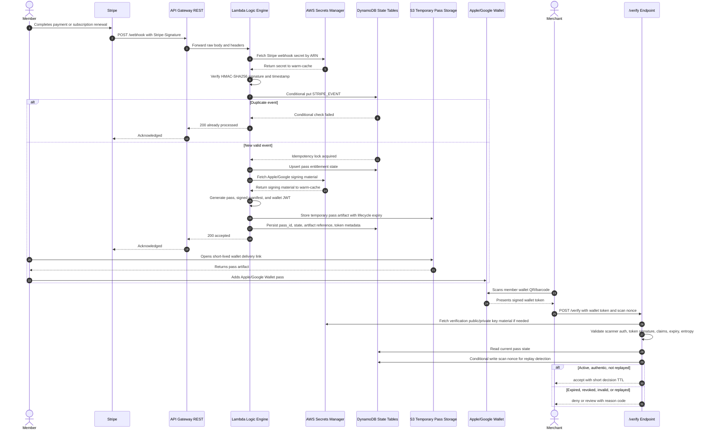

# VegSpoons Wallet Bridge Workflow

## Mermaid Sequence Diagram

## Workflow Notes

- Stripe webhooks are authenticated before parsing to preserve byte-for-byte HMAC verification.
- The idempotency table is the first write after signature validation.
- Pass artifacts in S3 are temporary delivery objects, not the source of truth.
- DynamoDB pass state is the source of truth for merchant decisions.
- Merchant verification is stateless at the Lambda runtime level and uses signed tokens plus current server-side state.
- Screenshot fraud is mitigated because the merchant scanner requires a live `/verify` response.

